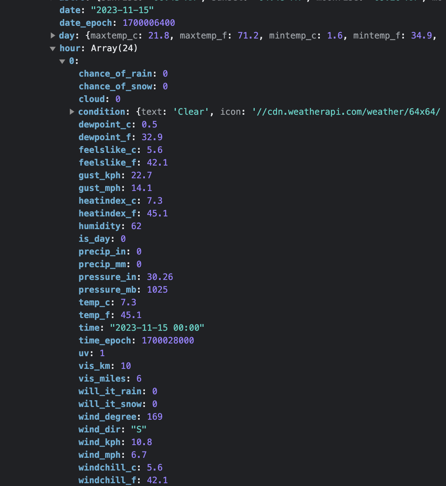

# odin-weather-app
Repo for the weather app project in the javascript course of the Odin Project

# Working Notes
### 11/15/23
- Before reading the prompt for this effort, I established the repo and also setup Webpack, Linter, and Prettier extensions for the project 
- Made a quick hack to test the API to see what the data looks like:
    - 
    - 
    - 
- Also refactored to try out the other syntax (rather than promise, async)
- Quick stab at the design:
    - 
    
# Todo
