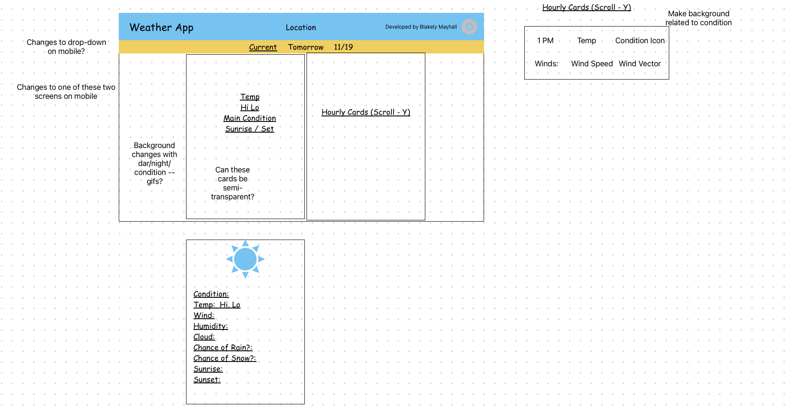

# odin-weather-app
Repo for the weather app project in the javascript course of the Odin Project

# Working Notes
### 11/15/23
- Before reading the prompt for this effort, I established the repo and also setup Webpack, Linter, and Prettier extensions for the project 
- Made a quick hack to test the API to see what the data looks like:
    - 
    - 
    - 
- Also refactored to try out the other syntax (rather than promise, async)
- Quick stab at the design:
    - 
    
### 11/20/23
- Got the initial html set up. Its pretty ugly, will need some cleaning, but I will try a different approach this time and focus on that near the end
- Going to try to recall some model-view-controller stuff from the Swift lessons I did a while ago 
    - Last project got a bit ugly with just a "DomManager"...

### 11/26/23
- Start MVC design with most simple part of page - the header bar
	- Yikes, this was harder than I thought it would be
- Need to spend some time thinking about this and researching.. its a bit fuzzy how this should all be implemented for maximum usefulness

# Todo
- Implement MVC for the header bar location
    - Add a button to enter location
        - Maybe a browser alert window.. don't think a form is needed
        - Look into ways to input location data. Don't want to open a rabbit hole here.
    - Default locaiton to St Louis